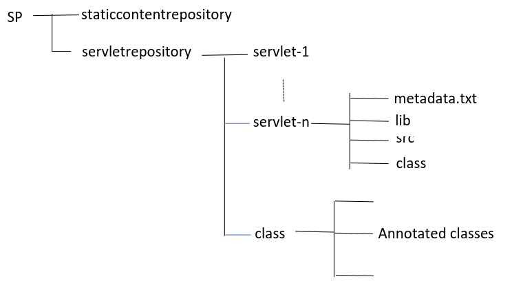

# tpbsca

Upgrade the Management Console in such a way to make it able to manage the loading
of servlets in which the association between the servlet class name and the URL request string is expressed in the form of an annotation. Upgrade the existing servlet code in such a way that it includes the following annotation: 

`@MyAnnotation (name = "URLServletName", value = "myservlet2").`

The annotation associates the URL request string to the executable class name in
the class folder.

Create an executable jar file called tpbsca.jar and place it in the SP folder. Place the annotated servlet source code in a subfolder named after the class name in the external servlet repository and compile it. Place the servlet .class file in the class folder in the “servletrepository” folder.

Include a new command named “load-with-annotations <servlet-name>” which loads the .class file included in the “class” folder in the “servletrepository” folder.

In the end students are supposed to deliver just an executable jar file, which includes the software components that they were able to complete. The executable jar must be included in a folder called SP which also includes a folder called “staticcontentrepository”, hosting the html files, and a folder called “servletrepository”. The servlet repository includes the servlet folders as well as a folder named class, hosting the annotated classes.

Here is the folder scheme.

